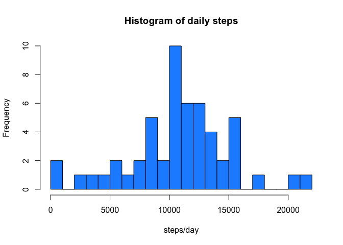
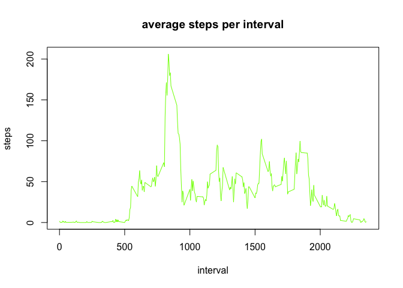
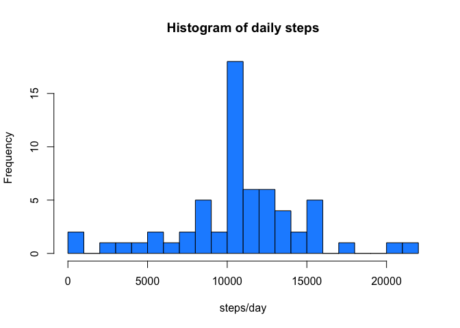
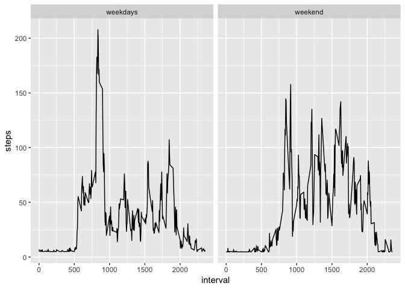

## Loading and preprocessing the data


```r
unzip("activity.zip")
activity <-read.csv("activity.csv", stringsAsFactors = FALSE)
activity$date <- as.Date(activity$date)
```


## What is mean total number of steps taken per day?


```r
Daily_steps <- aggregate(steps ~ date, data = activity,sum)
hist(Daily_steps$steps,xlab = "steps/day",main = "Histogram of daily steps", breaks = 20,col = "dodgerblue")
```

<!-- -->

```r
mean(Daily_steps$steps)
```

```
## [1] 10766.19
```

```r
median(Daily_steps$steps)
```

```
## [1] 10765
```


## What is the average daily activity pattern?

```r
interval_average <- aggregate(steps ~ interval,data = activity,mean)
plot(interval_average,type = "l",main = "average steps per interval", col = "chartreuse")
```

<!-- -->

```r
max(interval_average$steps)
```

```
## [1] 206.1698
```

```r
row_index <- which(interval_average$steps == max(interval_average$steps))
interval_average$interval[row_index]
```

```
## [1] 835
```


## Imputing missing values

```r
###### How many Nas
sum(is.na(activity$steps))
```

```
## [1] 2304
```

```r
steps_imputed <- activity
steps_imputed$steps[is.na(steps_imputed$steps)] <- mean(activity$steps,na.rm = TRUE)

sum(is.na(steps_imputed$steps))
```

```
## [1] 0
```

```r
Daily_steps2 <- aggregate(steps ~ date, data = steps_imputed,sum)
hist(Daily_steps2$steps,xlab = "steps/day",main = "Histogram of daily steps", breaks = 20,col = "dodgerblue")
```

<!-- -->

```r
mean(Daily_steps2$steps)
```

```
## [1] 10766.19
```

```r
median(Daily_steps2$steps)
```

```
## [1] 10766.19
```

After imputation mean did not change,but the median has slightly change for example,in the first data frame the result of the median 10765 after the elimination of the Nas the new median is 10766.19  


## Are there differences in activity patterns between weekdays and weekends?

```r
steps_imputed$weekdays <- weekdays(steps_imputed$date)

steps_imputed$weekdays <- sub("Monday|Tuesday|Wednesday|Thursday|Friday","weekdays",steps_imputed$weekdays)
steps_imputed$weekdays <- sub("Saturday|Sunday","weekend",steps_imputed$weekdays)
 
steps_imputed$weekdays<-as.factor(steps_imputed$weekdays)

library(ggplot2) 
weekdaysinterval_average <- aggregate(steps ~ interval*weekdays,data = steps_imputed,mean)
ggplot(weekdaysinterval_average,aes(x = interval, y = steps, group = weekdays)) + geom_line() + facet_wrap(~ weekdays)
```

<!-- -->

